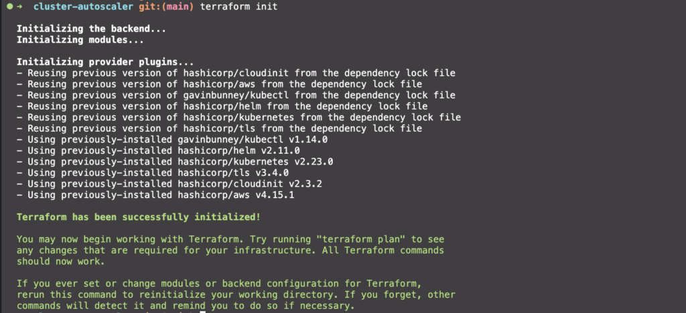
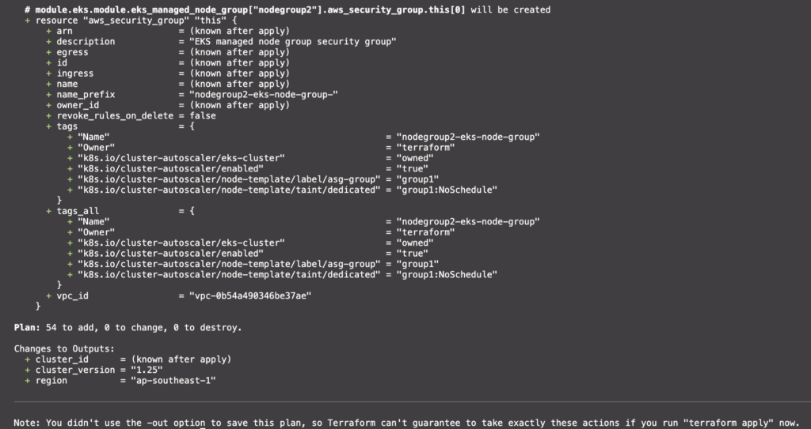
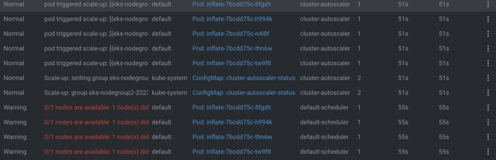
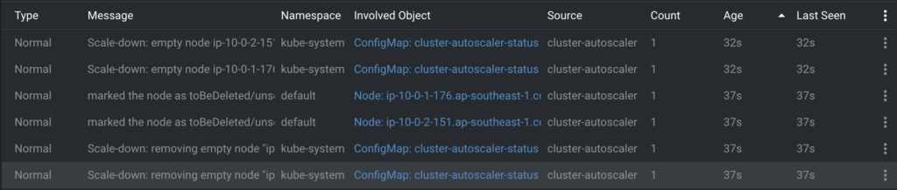
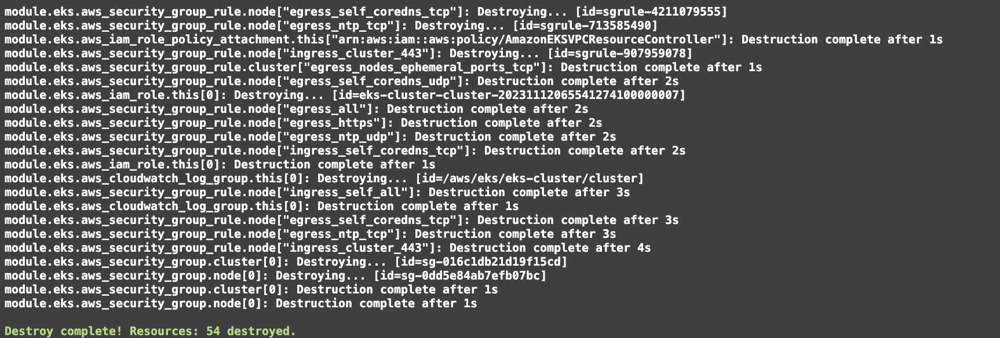

# Terraform EKS Cluster-autoscaler

Terraform deploy K8s Cluster-autoscaler with Helm.

## Prerequisite

- Terraform version 1.5.7
- AWS CLI

## Deployment

Initial terraform for loading required dependencies.

```sh
terraform init
```



Check terraform linter and planning resource.

```sh
terraform plan
```



Deploy EKS resources to AWS with command below.

```sh
terraform apply
```

Deploy a k8s deployment to your cluster.

```sh
kubectl apply -f k8s/deployment.yaml
```

Then you can scale-up Pod to 5 Pods.

```sh
kubectl scale deployment inflate --replicas 5
```



For scaling k8s pod to 0 replica.

```sh
kubectl scale deployment inflate --replicas 0
```



## Destroy

Use terraform destroy for your finished a tutorial.

```sh
terraform destroy
```


